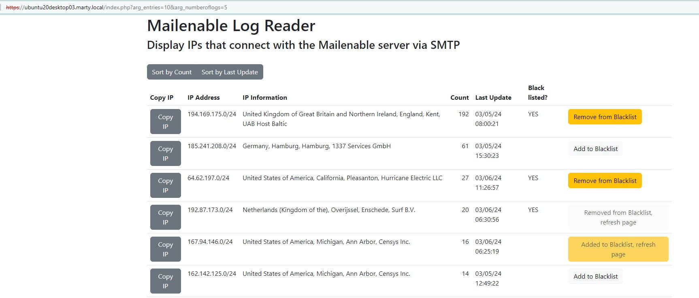

# Mailenable Log Reader

This is an initial project to load and display Mailenable logs using PHP on a separate Ubuntu server that runs Apache (it's what I'm most familiar with). Since .NET and IIS are installed on the Mailenable server, a separate project using C#/Razor/Blazor is in the works. 

This set of PHP programs will summarize the IP addresses with the highest number of hits to the Mailenable server. It currently looks at the SMTP logs, but can be easily changed to look at IMAP and POP logs.

<b><u>PLEASE NOTE:</u></b> This is not integrated with a Mailenable Windows server's firewall to stop brute force attacks; I use a Progress/Kemp reverse proxy to protect against incoming attacks. If you need brute force protection, check out https://github.com/ljans/shielding. I haven't tried this myself, but it looks promising.

## Details
There are six parts to this project:
1. index.php
2. mail_logreader.php or mail_logreader_ssh.php
3. logreaderapp.json
4. mailenable.js
5. mail_update_logreaderappjson.php
6. Geolocate module (please see another one of my projects [Github Geolocate](https://github.com/mosterho/GeoLocate))

### index.php
This is the initial PHP to call to load and display Mailenable logs. The call to the website contains two arguments:
1. Number of entries to display, and;
2. Number of logs to read

Please see the link below. It will display the top 10 entries read from the 5 most recent logs (not necessarily the last 5 days!):

https://ubuntu20desktop03.marty.local/index.php?arg_entries=10&arg_numberoflogs=5

The index.php will instantiate a class from the mail_logreader.php script as well as the Geolocate API. Once these are set, the code will read the entries from the mail_logreader.php class. For each row read, it will retrieve the Geolocation information for the IP via the Geolocate API class. 

Once the data are collected, they are output via PHP "echo" functions to produce HTML. Once the page is rendered, there are two buttons that appear near the headings: "sort by count" and "sort by last update". The page will initially display data that is sorted in descending order by count. Clicking on the "sort by count" button will refresh the page with updated counts. CLicking on the "sort by last update" button will also read the most current data, but also display the rows in descending order by last update date. The "blacklisted?" column displayes "YES" if the IP address is in the "blacklist" section of the logreaderapp.json file. The button on the far right will display one of four options:
* Add to Blacklist
* Remove from Blacklist
* Added to blacklist, refresh page (disabled)
* Removed from Blacklist, refresh page (disabled)

Once a "add/remove" button is clicked, hitting either the "sort by count" or "sort by last update" button will refresh the page. Clicking on the "Add to Blacklist" button doesn't do anything other than add the IP address to the logreaderapp.json "blacklist" section.

Note: the "copy" button the far left should copy the IP address to the clipboard; it currently works for me, but I assume that's becasue I'm using HTTPS.

### mail_logreader.php or mail_logreader_ssh.php
This is the workhorse of this project. This will read the SMTP logs in the Mailenable system.

As the file names imply, the mail_logreader.php will read plain FTP (probably OK if your server is within your LAN), while mail_logreader_ssh.php uses SSH to connect to the server.

The __construct will read the logreaderapp.json file. The JSON file contains three sections: path, whitelist, and blacklist. Please see the logreaderapp.json section for details.

Once the JSON file is loaded, the fct_readdir function must be called with the two arguments specified in the web link. The fct_readdir will retrieve the directory name found in the logreaderapp.json file. It will then scan the directory, parsing out the SMTP log file names via the fct_regex_results function. The regex looks for log file names such as "SMTP-Activity-240212.log". For each SMTP log file, it will then call the fct_readfile.

The fct_readfile function will read the log file data from the name passed in as arguments from fct_readdir. The IP address is broken down via regex, looking for the first three octets. The string '0/24' is tacked on to the three octets, which is then tested to see if it is in the whitelist section of the JSON file. If not, a counter is set and incremented by one. The date of the entry is compared to the most recent obtained. If the most recent entry's date is greater than the "hold" date, the "hold" date is replaced. The IP address is then checked against the blacklist. An array in the class will contain the IP address, counter, lmost recent date, and blacklist flag (T/F).

### logreaderapp.json
The logreaderapp.json file contains the following:
- path: This contains the FTP path to the log files;
- whitelist: This contains the IP addresses to ignore, and;
- blacklist: This contains the list of black listed IP addresses. You may not need any entries in this section of the JSON file; I use it to work with my load balancer/reverse proxy.

The logreaderapp.json file looks like this (the server and blacklist sections are changed). Note the "\\" for the the directory names when the path is on a Windows server:
{
    "method": "ftp://",
    "system": "mail.example.com",
    "path": "C:\\Program Files (x86)\\Mail Enable\\Logging\\SMTP\\",
    "user": "",
    "pwd": "",
    "pwd_key": "/home/ESIS/Encryption/mailenable_logreader/key01.json",
    "whitelist": [
        "10.0.0.0/8",
        "10.3.0.0/24",
        "10.126.26.0/24",
        "127.0.0.0/24",
        "172.16.0.0/16",
        "192.168.0.0/24",
        "192.168.1.0/24"
    ],
    "blacklist": [
        "123.456.789.0/24"
    ]
}

### mailenable.js
The Javascript portion of this project handles the button clicks on the header section and detail lines. It also calls the mail_update_logreaderappjson.php program to update the logreaderapp.json file based on IP button that is clicked.

### mail_update_logreaderappjson.php
This PHP program is backend processing only. it will read, add, and delete entries in the logreaderapp.json file.

### Sample Output
#### Sort by Count

#### Sort by Last Update
